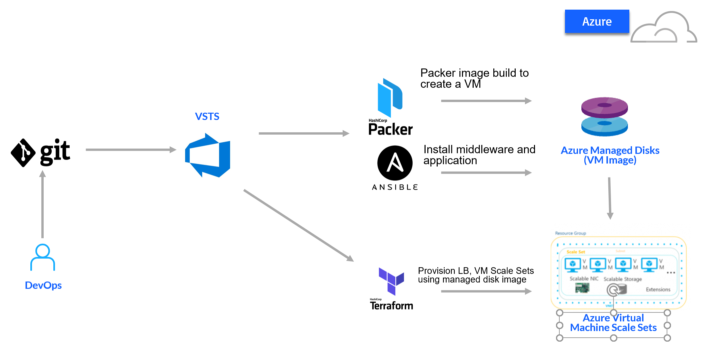

Continuous Integration and Deployment using VSTS , Packer, Terraform and Ansible
============

This repository contains code for the "Building Immutable infastructure Demo". Following is the flow:
- VSTS Build gets and packages artifacts from github 
- VSTS Release invokes packer to build image from Azure Marketplace Ubuntu image and save into ManagedDisk
- Packer uses `ansible-local` provisioner to install Apache and application code into the image
- VSTS Release invokes Terraform to provision Infrastructure (VMSS, LB, NSG) and point VMSS to image stored by packaer in ManagedDisks

## Packer
Packer template for Azure Image is located at `packer/app.json`. It stores prepared image in managed disks in Resource group provided by environment variable `ARM_RESOURCE_GROUP_DISKS`, this resource group should be created before the build (TODO: add creation to pipeline)

Packer will invoke `ansible-local` provisioner that will copy required files and invoke  `apache.yml` Ansible playbook
 
## Ansible
Ansible playbook`packer/apache.yml` installs and congigures Apache and copies application files (HTMLs, Images)
(TODO: wire more sophisticated playbook)

## Terraform
Terraform template is located at `terraform/azure`. It creates VM Scale Set based on Packer prepared imagestored in Managed disks
VSTS uses Azure Storage backend to store state file.  Storrge account and Container should be created before staring the build. (Defaults are in backend.tfvars)

